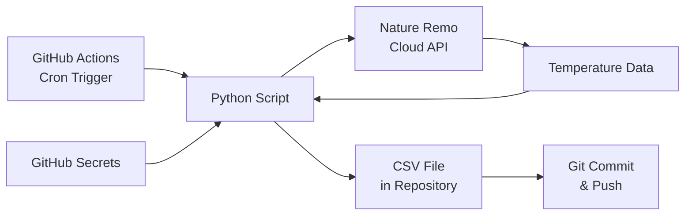

# 設計書

## 概要

本システムは、Nature Remo Cloud APIを使用して室温データを10分ごとに取得し、GitHub Actionsのスケジュール機能を利用して自動実行する温度記録システムです。取得したデータはGitHubリポジトリ内のCSVファイルに保存され、長期的な温度履歴の記録と分析を可能にします。

### 主要な設計決定

1. **実行環境**: GitHub Actions（無料枠を活用）
2. **データ保存**: GitHubリポジトリ内のCSVファイル
3. **実装言語**: Python（シンプルで読みやすく、HTTP APIクライアントとして最適）
4. **認証管理**: GitHub Secretsを使用した安全なトークン管理
5. **スケジューリング**: GitHub Actionsのcron構文（10分ごと）

### システムの利点

- 完全無料（パブリックリポジトリの場合）
- サーバー不要（サーバーレス）
- 設定が簡単
- データがGit管理されるため履歴追跡が容易
- GitHub Actionsのログで実行履歴を確認可能

## アーキテクチャ

### システム構成図



### コンポーネント概要

1. **GitHub Actions Workflow**: 10分ごとにPythonスクリプトを実行
2. **Temperature Logger Script**: Nature Remo APIを呼び出し、データを取得・保存
3. **Data Store**: リポジトリ内のCSVファイル（`data/temperature.csv`）
4. **Configuration**: GitHub Secretsに保存されたAPI認証情報

### データフロー

1. GitHub Actionsがcronスケジュールに基づいてワークフローを起動
2. Pythonスクリプトが実行され、GitHub SecretsからAPI_TOKENを取得
3. Nature Remo Cloud APIに対してHTTPSリクエストを送信（GET /1/devices）
4. APIレスポンスから温度データを抽出
5. タイムスタンプと温度値をCSVファイルに追記
6. 変更をGitリポジトリにコミット・プッシュ

## コンポーネントとインターフェース

### 1. GitHub Actions Workflow

**ファイル**: `.github/workflows/temperature-logger.yml`

**責務**:
- 10分ごとにワークフローを実行
- Pythonスクリプトの実行環境を準備
- GitHub Secretsから環境変数を設定
- Gitの設定とコミット・プッシュ

**主要設定**:
```yaml
on:
  schedule:
    - cron: '*/10 * * * *'  # 10分ごと
  workflow_dispatch:  # 手動実行も可能
```

**環境変数**:
- `NATURE_REMO_TOKEN`: Nature Remo APIアクセストークン（GitHub Secretsから取得）

### 2. Temperature Logger Script

**ファイル**: `logger.py`

**責務**:
- Nature Remo APIへのHTTPリクエスト
- レスポンスのパースと検証
- CSVファイルへのデータ書き込み
- エラーハンドリングとログ出力

**主要関数**:

```python
def get_temperature() -> float:
    """
    Nature Remo APIから現在の温度を取得
    
    Returns:
        float: 温度（摂氏）
    
    Raises:
        APIError: API呼び出しが失敗した場合
        ValueError: レスポンスのパースに失敗した場合
    """
    pass

def save_temperature(timestamp: str, temperature: float) -> None:
    """
    温度データをCSVファイルに保存
    
    Args:
        timestamp: ISO 8601形式のタイムスタンプ
        temperature: 温度値
    
    Raises:
        IOError: ファイル書き込みに失敗した場合
    """
    pass

def validate_temperature(temperature: float) -> bool:
    """
    温度値が妥当な範囲内かチェック
    
    Args:
        temperature: 検証する温度値
    
    Returns:
        bool: 妥当な範囲内の場合True
    """
    pass

def main() -> None:
    """
    メイン処理
    1. APIトークンの取得
    2. 温度データの取得
    3. データの検証
    4. CSVへの保存
    """
    pass
```

### 3. Nature Remo Cloud API Client

**エンドポイント**: `https://api.nature.global/1/devices`

**認証**: Bearer Token（Authorizationヘッダー）

**リクエスト例**:
```http
GET /1/devices HTTP/1.1
Host: api.nature.global
Authorization: Bearer {ACCESS_TOKEN}
```

**レスポンス構造**:
```json
[
  {
    "id": "device-id",
    "name": "Living Room",
    "temperature_offset": 0,
    "humidity_offset": 0,
    "created_at": "2023-01-01T00:00:00Z",
    "updated_at": "2023-01-01T12:00:00Z",
    "firmware_version": "Remo/1.0.0",
    "mac_address": "xx:xx:xx:xx:xx:xx",
    "serial_number": "1234567890",
    "newest_events": {
      "te": {
        "val": 25.5,
        "created_at": "2023-01-01T12:00:00Z"
      },
      "hu": {
        "val": 50,
        "created_at": "2023-01-01T12:00:00Z"
      }
    }
  }
]
```

**温度データの抽出**:
- パス: `devices[0].newest_events.te.val`
- 型: float
- 単位: 摂氏（℃）

**レート制限**:
- 5分間に30リクエストまで
- 10分ごとの実行では制限内に収まる

### 4. Data Store (CSV File)

**ファイルパス**: `data/temperature.csv`

**フォーマット**:
```csv
timestamp,temperature
2024-01-01T00:00:00+09:00,25.5
2024-01-01T00:10:00+09:00,25.3
2024-01-01T00:20:00+09:00,25.4
```

**カラム定義**:
- `timestamp`: ISO 8601形式のタイムスタンプ（タイムゾーン付き）
- `temperature`: 温度値（小数点以下1桁、単位: ℃）

**ファイル管理**:
- ヘッダー行は初回作成時のみ追加
- 新しいデータは常にファイル末尾に追記
- エンコーディング: UTF-8（BOMなし）

## データモデル

### TemperatureRecord

温度記録の単一エントリを表すデータモデル

**属性**:
- `timestamp` (str): ISO 8601形式のタイムスタンプ
  - 例: `"2024-01-01T12:00:00+09:00"`
  - 必須
  - タイムゾーン情報を含む
  
- `temperature` (float): 温度値（摂氏）
  - 範囲: -50.0 ～ 50.0
  - 精度: 小数点以下1桁
  - 必須

**検証ルール**:
1. timestampは有効なISO 8601形式であること
2. temperatureは数値であること
3. temperatureは妥当な範囲内（-50℃～50℃）であること
4. 同一timestampの重複レコードは許可しない

### APIResponse

Nature Remo APIからのレスポンスを表すデータモデル

**属性**:
- `devices` (list): デバイスのリスト
  - 各デバイスは以下の構造を持つ:
    - `id` (str): デバイスID
    - `name` (str): デバイス名
    - `newest_events` (dict): 最新のセンサーイベント
      - `te` (dict): 温度イベント
        - `val` (float): 温度値
        - `created_at` (str): 測定時刻

**抽出ロジック**:
```python
temperature = response['devices'][0]['newest_events']['te']['val']
```

## 正確性プロパティ

正確性プロパティは、システムが満たすべき普遍的な特性を形式的に記述したものです。これらのプロパティは、プロパティベーステスト（PBT）を通じて検証され、システムの正確性を保証します。


### プロパティ1: 環境変数からのトークン取得

*任意の*実行時において、システムは環境変数からAPI_Tokenを正しく取得し、それを使用してAPI呼び出しを行う

**検証要件: 1.2**

### プロパティ2: トークンの機密性保護

*任意の*ログ出力やファイル出力において、API_Tokenが平文で含まれていない

**検証要件: 1.4**

### プロパティ3: HTTPS通信の使用

*任意の*API呼び出しにおいて、システムはHTTPSプロトコルを使用してNature Remo APIと通信する

**検証要件: 2.1**

### プロパティ4: 成功レスポンスからのデータ抽出

*任意の*成功レスポンス（200 OK）に対して、システムは温度データを正しく抽出できる

**検証要件: 2.2**

### プロパティ5: エラーレスポンスのリトライ

*任意の*エラーレスポンス（4xx, 5xx）に対して、システムはエラーをログに記録し、最大3回までリトライを試みる

**検証要件: 2.3, 5.2**

### プロパティ6: タイムスタンプの形式

*任意の*温度データレコードにおいて、タイムスタンプはISO 8601形式（タイムゾーン付き）で記録される

**検証要件: 2.4, 9.2**

### プロパティ7: CSV形式での保存

*任意の*温度データに対して、システムはCSV形式で正しくデータを保存し、ヘッダー行「timestamp,temperature」を含む

**検証要件: 4.1, 4.3, 6.5**

### プロパティ8: ファイルへのデータ追記

*任意の*新しい温度データに対して、システムは既存のCSVファイルに新しい行を追加し、既存データを保持する

**検証要件: 4.2**

### プロパティ9: エラーログの記録

*任意の*エラー発生時において、システムはエラーメッセージ、タイムスタンプ、エラータイプをログに記録する

**検証要件: 5.1**

### プロパティ10: データ保存失敗時の保護

*任意の*データ保存失敗時において、システムはエラーを記録し、データを失わないように処理する

**検証要件: 5.5**

### プロパティ11: 温度値の検証

*任意の*取得した温度値に対して、システムは数値であることを検証し、妥当な範囲（-50℃〜50℃）内であることを確認する

**検証要件: 6.1, 6.2**

### プロパティ12: 重複タイムスタンプの拒否

*任意の*温度データに対して、システムは既に存在するタイムスタンプと重複するデータを保存しない

**検証要件: 6.4**

### プロパティ13: JSON形式のサポート（オプション）

*任意の*温度データに対して、システムはCSV形式に加えてJSON形式での保存もサポートする

**検証要件: 8.2**

### プロパティ14: 環境変数による設定

*任意の*設定項目に対して、システムは環境変数を通じて設定を変更可能にする

**検証要件: 8.3**

### プロパティ15: 機械可読形式とエンコーディング

*任意の*出力ファイルに対して、システムは機械可読可能な形式（CSV、JSON）で保存し、BOM（Byte Order Mark）を含めない

**検証要件: 9.1, 9.4**

### プロパティ16: 温度値の精度

*任意の*温度値に対して、システムは小数点以下1桁まで保存する

**検証要件: 9.3**

## エラーハンドリング

### エラーの分類

1. **API関連エラー**
   - 認証エラー（401 Unauthorized）
   - レート制限エラー（429 Too Many Requests）
   - サーバーエラー（5xx）
   - タイムアウトエラー
   - ネットワークエラー

2. **データ検証エラー**
   - 温度値が数値でない
   - 温度値が範囲外
   - タイムスタンプの形式が不正
   - 重複タイムスタンプ

3. **ファイルI/Oエラー**
   - ファイル書き込み失敗
   - ディレクトリ作成失敗
   - ファイル読み込み失敗

### エラーハンドリング戦略

#### 1. API関連エラー

**リトライ可能なエラー**（最大3回リトライ）:
- 5xx サーバーエラー
- タイムアウトエラー
- 一時的なネットワークエラー

**リトライ不可能なエラー**（即座に失敗）:
- 401 認証エラー（トークンが無効）
- 400 不正なリクエスト

**リトライ戦略**:
```python
def retry_with_backoff(func, max_retries=3):
    """
    指数バックオフを使用したリトライ
    
    待機時間: 1秒, 2秒, 4秒
    """
    for attempt in range(max_retries):
        try:
            return func()
        except RetryableError as e:
            if attempt == max_retries - 1:
                raise
            wait_time = 2 ** attempt
            time.sleep(wait_time)
            log_retry(attempt + 1, wait_time)
```

#### 2. データ検証エラー

**温度値の検証**:
```python
def validate_temperature(temp: float) -> tuple[bool, str]:
    """
    温度値を検証
    
    Returns:
        (is_valid, error_message)
    """
    if not isinstance(temp, (int, float)):
        return False, "Temperature must be a number"
    
    if temp < -50 or temp > 50:
        log_warning(f"Temperature {temp}°C is out of normal range")
        # 範囲外でも保存は継続
    
    return True, ""
```

**タイムスタンプの検証**:
```python
def validate_timestamp(ts: str) -> tuple[bool, str]:
    """
    ISO 8601形式のタイムスタンプを検証
    """
    try:
        datetime.fromisoformat(ts)
        return True, ""
    except ValueError as e:
        return False, f"Invalid timestamp format: {e}"
```

#### 3. ファイルI/Oエラー

**ファイル書き込みの安全性**:
```python
def safe_write_csv(data: TemperatureRecord):
    """
    安全なCSV書き込み
    
    1. 一時ファイルに書き込み
    2. 書き込み成功後に本ファイルに移動
    3. エラー時は一時ファイルを削除
    """
    temp_file = "data/temperature.csv.tmp"
    target_file = "data/temperature.csv"
    
    try:
        write_to_file(temp_file, data)
        os.rename(temp_file, target_file)
    except Exception as e:
        if os.path.exists(temp_file):
            os.remove(temp_file)
        raise IOError(f"Failed to write CSV: {e}")
```

### ログレベルの定義

- **ERROR**: システムが継続できない致命的なエラー
  - 例: 全リトライ失敗、認証エラー
  
- **WARNING**: 注意が必要だが処理は継続可能
  - 例: 温度値が範囲外、リトライ実行中
  
- **INFO**: 通常の動作情報
  - 例: 温度データ取得成功、ファイル保存完了
  
- **DEBUG**: デバッグ用の詳細情報
  - 例: APIリクエスト/レスポンスの詳細

## テスト戦略

### デュアルテストアプローチ

本システムでは、ユニットテストとプロパティベーステスト（PBT）の両方を使用して包括的なテストカバレッジを実現します。

**ユニットテスト**:
- 特定の例やエッジケースの検証
- エラー条件の確認
- コンポーネント間の統合ポイントの検証

**プロパティベーステスト**:
- 普遍的なプロパティの検証
- ランダム入力による包括的なカバレッジ
- 最小100回の反復実行

### テストフレームワーク

**ユニットテスト**: `pytest`
**プロパティベーステスト**: `hypothesis`

### プロパティテストの設定

各プロパティテストは以下の形式でタグ付けします：

```python
@given(temperature=st.floats(min_value=-50, max_value=50))
@settings(max_examples=100)
def test_property_temperature_validation(temperature):
    """
    Feature: nature-remo-temperature-logger, Property 11: 温度値の検証
    
    任意の取得した温度値に対して、システムは数値であることを検証し、
    妥当な範囲（-50℃〜50℃）内であることを確認する
    """
    result = validate_temperature(temperature)
    assert result is True
```

### テストカバレッジ目標

- **コードカバレッジ**: 80%以上
- **プロパティカバレッジ**: 全16プロパティをテスト
- **エッジケースカバレッジ**: 主要なエラーケースをユニットテストで網羅

### テストケースの例

#### ユニットテスト例

```python
def test_api_token_from_env():
    """環境変数からAPIトークンを取得"""
    os.environ['NATURE_REMO_TOKEN'] = 'test_token'
    token = get_api_token()
    assert token == 'test_token'

def test_invalid_token_error():
    """無効なトークンでエラーが発生"""
    with pytest.raises(AuthenticationError):
        get_temperature(token='invalid_token')

def test_csv_header_creation():
    """CSVファイルが存在しない場合、ヘッダー付きで作成"""
    if os.path.exists('test.csv'):
        os.remove('test.csv')
    
    save_temperature('2024-01-01T00:00:00+09:00', 25.5, 'test.csv')
    
    with open('test.csv', 'r') as f:
        first_line = f.readline().strip()
        assert first_line == 'timestamp,temperature'

def test_timeout_error():
    """APIタイムアウトでエラーが発生"""
    with pytest.raises(TimeoutError):
        get_temperature(timeout=0.001)

def test_out_of_range_temperature_warning():
    """範囲外の温度で警告が記録されるが保存は継続"""
    with pytest.warns(UserWarning):
        save_temperature('2024-01-01T00:00:00+09:00', 100.0)

def test_default_config():
    """デフォルト設定で動作可能"""
    config = load_config()
    assert config['format'] == 'csv'
    assert config['output_dir'] == 'data'
```

#### プロパティベーステスト例

```python
from hypothesis import given, strategies as st

@given(timestamp=st.datetimes())
@settings(max_examples=100)
def test_property_timestamp_format(timestamp):
    """
    Feature: nature-remo-temperature-logger, Property 6: タイムスタンプの形式
    
    任意の温度データレコードにおいて、タイムスタンプはISO 8601形式
    （タイムゾーン付き）で記録される
    """
    iso_string = format_timestamp(timestamp)
    # ISO 8601形式で再パース可能
    parsed = datetime.fromisoformat(iso_string)
    assert parsed is not None
    # タイムゾーン情報を含む
    assert '+' in iso_string or 'Z' in iso_string

@given(
    existing_data=st.lists(
        st.tuples(st.datetimes(), st.floats(min_value=-50, max_value=50)),
        min_size=1
    ),
    new_data=st.tuples(st.datetimes(), st.floats(min_value=-50, max_value=50))
)
@settings(max_examples=100)
def test_property_file_append(existing_data, new_data):
    """
    Feature: nature-remo-temperature-logger, Property 8: ファイルへのデータ追記
    
    任意の新しい温度データに対して、システムは既存のCSVファイルに
    新しい行を追加し、既存データを保持する
    """
    # 既存データを書き込み
    write_csv(existing_data, 'test.csv')
    original_count = len(existing_data)
    
    # 新しいデータを追記
    append_csv(new_data, 'test.csv')
    
    # 既存データ + 新データが存在
    all_data = read_csv('test.csv')
    assert len(all_data) == original_count + 1
    
    # 既存データが保持されている
    for i, (ts, temp) in enumerate(existing_data):
        assert all_data[i] == (ts, temp)

@given(temperature=st.floats())
@settings(max_examples=100)
def test_property_temperature_validation(temperature):
    """
    Feature: nature-remo-temperature-logger, Property 11: 温度値の検証
    
    任意の取得した温度値に対して、システムは数値であることを検証し、
    妥当な範囲（-50℃〜50℃）内であることを確認する
    """
    is_valid, message = validate_temperature(temperature)
    
    # 数値であることは常に検証される
    assert isinstance(is_valid, bool)
    
    # 範囲内の場合は有効
    if -50 <= temperature <= 50:
        assert is_valid is True
    # 範囲外でも数値なら警告付きで有効（保存は継続）
    else:
        # 警告がログに記録されることを確認
        assert message != ""

@given(
    data=st.lists(
        st.tuples(st.datetimes(), st.floats(min_value=-50, max_value=50)),
        min_size=2
    )
)
@settings(max_examples=100)
def test_property_duplicate_timestamp_rejection(data):
    """
    Feature: nature-remo-temperature-logger, Property 12: 重複タイムスタンプの拒否
    
    任意の温度データに対して、システムは既に存在するタイムスタンプと
    重複するデータを保存しない
    """
    # 最初のデータを保存
    first_ts, first_temp = data[0]
    save_temperature(first_ts, first_temp, 'test.csv')
    
    # 同じタイムスタンプで異なる温度を保存しようとする
    with pytest.raises(DuplicateTimestampError):
        save_temperature(first_ts, first_temp + 1.0, 'test.csv')

@given(log_output=st.text())
@settings(max_examples=100)
def test_property_token_confidentiality(log_output):
    """
    Feature: nature-remo-temperature-logger, Property 2: トークンの機密性保護
    
    任意のログ出力やファイル出力において、API_Tokenが平文で含まれていない
    """
    token = "secret_token_12345"
    sanitized_log = sanitize_log(log_output, token)
    
    # トークンが含まれていない
    assert token not in sanitized_log
    # マスクされている
    if token in log_output:
        assert "***" in sanitized_log or "[REDACTED]" in sanitized_log

@given(temperature=st.floats(min_value=-50, max_value=50))
@settings(max_examples=100)
def test_property_temperature_precision(temperature):
    """
    Feature: nature-remo-temperature-logger, Property 16: 温度値の精度
    
    任意の温度値に対して、システムは小数点以下1桁まで保存する
    """
    formatted = format_temperature(temperature)
    
    # 小数点以下1桁
    decimal_part = formatted.split('.')[1] if '.' in formatted else ""
    assert len(decimal_part) <= 1
    
    # 四捨五入が正しい
    expected = round(temperature, 1)
    assert float(formatted) == expected

@given(file_content=st.binary())
@settings(max_examples=100)
def test_property_no_bom(file_content):
    """
    Feature: nature-remo-temperature-logger, Property 15: 機械可読形式とエンコーディング
    
    任意の出力ファイルに対して、システムは機械可読可能な形式（CSV、JSON）で
    保存し、BOM（Byte Order Mark）を含めない
    """
    # ファイルを書き込み
    write_file('test.csv', file_content)
    
    # BOMが含まれていない
    with open('test.csv', 'rb') as f:
        first_bytes = f.read(3)
        assert first_bytes != b'\xef\xbb\xbf'  # UTF-8 BOM
```

### 継続的インテグレーション

GitHub Actionsでテストを自動実行：

```yaml
name: Tests

on: [push, pull_request]

jobs:
  test:
    runs-on: ubuntu-latest
    steps:
      - uses: actions/checkout@v2
      - name: Set up Python
        uses: actions/setup-python@v2
        with:
          python-version: '3.11'
      - name: Install dependencies
        run: |
          pip install -r requirements.txt
          pip install pytest hypothesis pytest-cov
      - name: Run unit tests
        run: pytest tests/unit/ -v
      - name: Run property tests
        run: pytest tests/property/ -v --hypothesis-show-statistics
      - name: Generate coverage report
        run: pytest --cov=logger --cov-report=html
```

### テスト実行コマンド

```bash
# 全テスト実行
pytest

# ユニットテストのみ
pytest tests/unit/

# プロパティテストのみ
pytest tests/property/

# カバレッジレポート付き
pytest --cov=logger --cov-report=html

# 特定のプロパティテスト
pytest tests/property/test_temperature_validation.py -v
```
